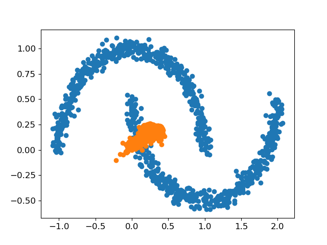
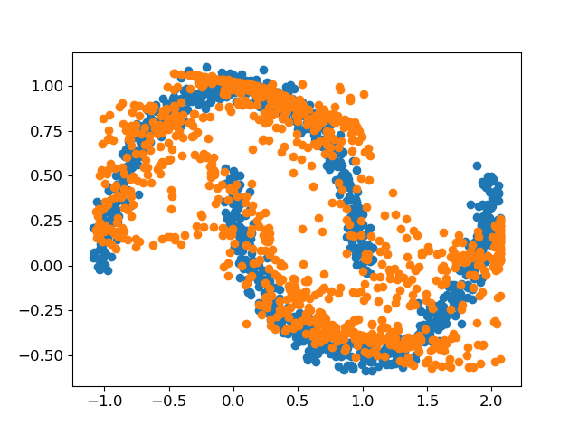
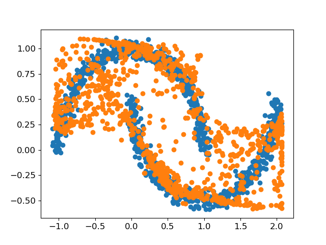
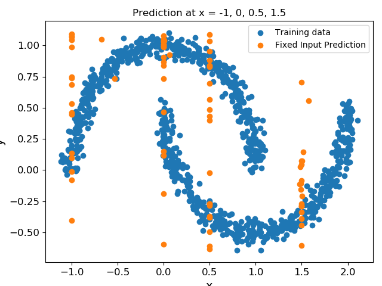
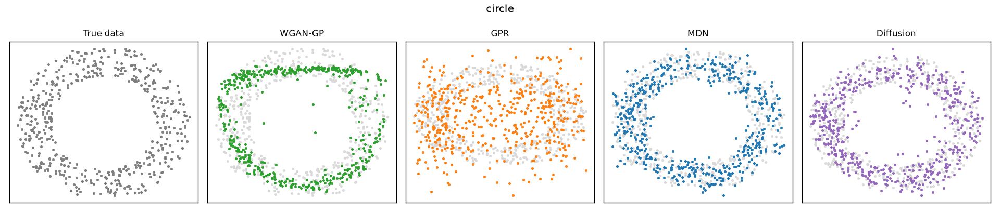
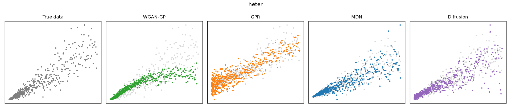
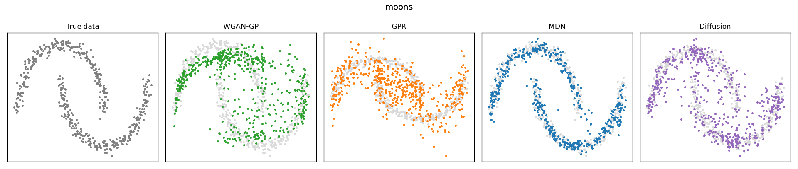

# WGAN-Regression

[](https://github.com/ellyess/WGAN-Regression/actions/workflows/ci.yml)
[](https://doi.org/10.3390/app12189209)
[](requirements.txt)
[](LICENSE)

**Regression with Wasserstein Generative Adversarial Networks**: the original research code behind the published paper [*Multi-Output Regression with Generative Adversarial Networks (MOR-GANs)*](https://doi.org/10.3390/app12189209) (Applied Sciences, 2022), extended into a tested, benchmarked package with TensorFlow and PyTorch backends.

Standard regression models predict a single "best" output for each input. This project takes a different route: train a **WGAN-GP** on the *joint* distribution of inputs and outputs, then make predictions by **optimising the generator's latent space** until generated samples land on a query input. Because every prediction is a fresh sample from the learned conditional distribution p(y | x), the model naturally handles noise, heteroscedasticity, and even **multi-valued and multi-modal** responses that would break a conventional regressor, and it does so with no problem-specific tuning.

| Training start | Mid training | Trained |
|:---:|:---:|:---:|
|  |  |  |

*The generator (orange) learning the joint distribution of the two-moons dataset (blue).*

<p align="center">
  
</p>

*Fixed-input prediction: samples of y drawn at pinned x locations. Where the data is multi-valued (two moon branches at the same x), the model returns samples on **both** branches, which is exactly what a mean-based regressor cannot do.*

## Project history

This repository is my Independent Research Project (MSc, Imperial College London): I developed the WGAN-GP regression approach, the latent-space-optimisation prediction method, the benchmark datasets and the GPR comparison here. I then handed the work off for publication; it was extended into the [MORGAN-Framework](https://github.com/trfphillips/MORGAN-Framework) and published as:

> Phillips, T. R. F.; Heaney, C. E.; **Benmoufok, E.**; Li, Q.; Hua, L.; Porter, A. E.; Chung, K. F.; Pain, C. C.
> *Multi-Output Regression with Generative Adversarial Networks (MOR-GANs).*
> Applied Sciences **12**(18), 9209 (2022). [doi:10.3390/app12189209](https://doi.org/10.3390/app12189209)

Since publication the repository has been extended with a PyTorch port, MDN and conditional-diffusion baselines, quantitative distribution metrics, a 50x faster batched prediction routine, tests and CI. The original method is unchanged; see [`docs/METHOD.md`](docs/METHOD.md) for the full write-up.

## How it works

1. **Learn the joint distribution.** Each training pair (x, y) is one point in an n-dimensional space. A WGAN with gradient penalty (generator + critic) is trained to generate points indistinguishable from the data.
2. **Predict by latent-space optimisation.** For a query x\*, gradient-descend on the latent vector z (generator frozen) until the generated point's input coordinates match x\*. Its output coordinates are then a draw from p(y | x = x\*). All queries are optimised as one batch, with optional multi-restart search for robustness.
3. **Evaluate as distributions.** Every model in the benchmark (WGAN, GPR, MDN, diffusion) produces *samples* of y, scored with conditional Wasserstein distance, joint MMD and KDE log-likelihood.

## Benchmark

`scripts/run_benchmark.py` trains every model on all eight datasets, selects WGAN checkpoints by validation conditional-W1 (with early stopping), and scores everything with the metrics in `wgan_regression/metrics.py`. Full table and numbers: [`docs/BENCHMARK.md`](docs/BENCHMARK.md). The baselines are chosen to make the comparison honest: **GPR** is the classical probabilistic regressor the paper compared against, the **Mixture Density Network** is the classic neural answer to multi-modal regression, and **conditional diffusion** is the post-2022 state of the art in generative modelling.



*The headline case: on the multi-valued `circle` dataset the GPR collapses into a filled blob (a Gaussian conditional cannot represent two y branches, so posterior samples fill the hole) while the WGAN reproduces the annulus and posts the best conditional W1 of all four models (0.15 vs 0.21 to 0.26).*



*On `heter`, the WGAN tracks the vanishing noise at small x while GPR's constant-noise assumption over-scatters that region.*



Findings, honestly stated:

- The WGAN's advantage shows exactly where the paper claimed: multi-valued responses (`circle`, best of all models) and input-dependent noise (`heter`, competitive), where Gaussian assumptions break.
- On simple uni-modal data (`sinus`, `3d`) the WGAN has no advantage and the classical/lighter models win on the numbers.
- The 2022-era baselines are strong: the MDN and conditional diffusion match or beat the WGAN on most synthetic sets, though the MDN fails badly on the real `eye` data (W1 176 vs the WGAN's 32 and diffusion's 16).
- A **modernised training variant** (`training_config="modern"`: TTUR, reference gradient penalty, generator EMA; see [`docs/METHOD.md`](docs/METHOD.md)) trains roughly twice as fast per epoch but is not a uniform quality win: better on `heter`, `eye` and `multi`, worse on `circle`, `sinus` and `3d`. The faithful paper configuration holds up. Both configurations ship as pretrained weights and appear as separate rows in the results table.

## Repository structure

```
├── wgan_regression/              # The library (TensorFlow backend)
│   ├── wgan.py                   #   WGAN-GP: training + batched latent-space prediction
│   ├── networks.py               #   Generator and critic architectures
│   ├── datasets.py               #   Benchmark datasets (sine, circle, moons, multimodal, ...)
│   ├── metrics.py                #   Conditional W1, joint MMD, KDE NLL
│   ├── mdn.py                    #   Mixture Density Network baseline
│   ├── gpr.py                    #   Gaussian Process Regression baseline (GPy)
│   ├── density.py                #   Conditional-slice helpers for density plots
│   └── pytorch/                  # PyTorch backend
│       ├── wgan.py               #   API-compatible WGAN-GP port
│       ├── networks.py           #   Generator and critic in torch.nn
│       └── diffusion.py          #   Conditional DDPM baseline
├── scripts/
│   ├── run_fixed_input.py        # Train + fixed-input prediction (CLI)
│   └── run_benchmark.py          # Full model comparison with metrics + figures
├── tests/                        # Pytest suite (run in CI)
├── notebooks/                    # Walkthrough notebooks
├── pretrained/                   # Generator weights per dataset (from the benchmark)
├── data/                         # CSV/XLSX datasets
└── docs/
    ├── METHOD.md                 # Method write-up
    ├── BENCHMARK.md              # Benchmark results table
    └── figures/                  # Result figures
```

## Getting started

Everything runs locally on CPU; no notebooks services or GPUs required.

```bash
git clone https://github.com/ellyess/WGAN-Regression.git
cd WGAN-Regression
pip install -r requirements.txt
```

> `GPy` is only needed for the GPR baseline and `torch` only for the PyTorch backend and diffusion baseline; everything else works without them.

Train on a dataset and predict at fixed inputs (figures are written to `outputs/`):

```bash
python scripts/run_fixed_input.py --scenario moons
python scripts/run_fixed_input.py --help          # all options
```

Or use the library directly. With the shipped pretrained weights you can skip training entirely:

```python
import numpy as np
from wgan_regression import WGAN, datasets
# from wgan_regression.pytorch import WGAN       # same API, PyTorch backend

X_train, y_train, *_ = datasets.get_dataset(500, "moons", seed=0)

wgan = WGAN(n_features=2)                        # match_cols=1 -> fixed-input mode
train_ds, scaler, _ = wgan.preproc(X_train, y_train)
wgan.generator.load_weights("pretrained/moons_generator.h5")   # or wgan.train(train_ds, epochs=1000)

xs = np.repeat([-1.0, 0.0, 0.5, 1.5], 20)                      # pinned query inputs
queries = np.stack([xs, np.zeros_like(xs)], axis=1)
queries_scaled = scaler.transform(queries) * 2 - 1
samples = wgan.predict(queries_scaled, scaler, restarts=5, init_std=1.0)
```

Reproduce the benchmark, tests and lint:

```bash
python scripts/run_benchmark.py                   # ~1h CPU; add --epochs 200 for a quick pass
pytest -q
ruff check .
```

### Prediction performance

Prediction originally optimised each query point's latent vector in its own Python loop (500 Adam steps per point, tens of seconds for a batch of queries). The search now runs for **all queries in one compiled batch**, which is ~50x faster (80 queries: under a second versus ~40 s), and supports **multi-restart search** (`restarts=R` keeps the best of R independent searches per query) for robustness against local minima at almost no extra cost.

## Datasets

`wgan_regression/datasets.py` provides eight benchmark scenarios, each chosen to stress a different failure mode of standard regression:

| Scenario | Inputs | Challenge |
|---|---|---|
| `sinus` | 1 | Baseline smooth curve with noise |
| `circle` | 1 | Multi-valued: two y branches per x |
| `multi` | 1 | Multi-modal conditional distribution |
| `moons` | 1 | Interleaved crescents (`sklearn.datasets.make_moons`) |
| `heter` | 1 | Heteroscedastic (input-dependent) noise |
| `eye` | 1 | Real measurement data (`data/eyedata.csv`) |
| `3d` | 2 | Two-input surface (cone) |
| `helix` | 2 | 3-D curve, not a function of its inputs |

## Citation

If you use this code or build on the method, please cite the paper:

```bibtex
@article{phillips2022morgans,
  author  = {Phillips, Toby R. F. and Heaney, Claire E. and Benmoufok, Ellyess and
             Li, Qingyang and Hua, Lily and Porter, Alexandra E. and
             Chung, Kian Fan and Pain, Christopher C.},
  title   = {Multi-Output Regression with Generative Adversarial Networks (MOR-GANs)},
  journal = {Applied Sciences},
  volume  = {12},
  number  = {18},
  pages   = {9209},
  year    = {2022},
  doi     = {10.3390/app12189209}
}
```

## Acknowledgements

Developed under the supervision of Christopher Pain, Alexandra Porter and Toby Phillips (Imperial College London).

## License

[MIT](LICENSE)
